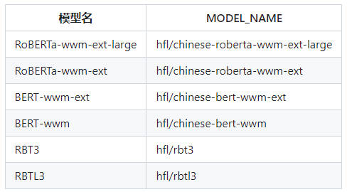

# 项目介绍


# 预训练模型
## 1、中文模型
&emsp;&emsp;在中文中我们将使用到下图所示的模型

<div align="center">
  
</div>

<p align="center">中文选用预训练模型</p>

&emsp;&emsp;使用transformers下载上述模型

```python
tokenizer = BertTokenizer.from_pretrained("MODEL_NAME")
model = BertModel.from_pretrained("MODEL_NAME")
```

## 2、英文模型

&emsp;&emsp;英文模型使用从huggingface下载的预训练模型，你可以通过下面的python代码获取

```python
# Import generic wrappers
from transformers import AutoModel, AutoTokenizer
# Define the model repo
model_name = "SpanBERT/spanbert-base-cased"
# Download pytorch model
model = AutoModel.from_pretrained(model_name)
tokenizer = AutoTokenizer.from_pretrained(model_name)
# Transform input tokens
inputs = tokenizer("Hello world!", return_tensors="pt")
# Model apply
outputs = model(**inputs)
```
